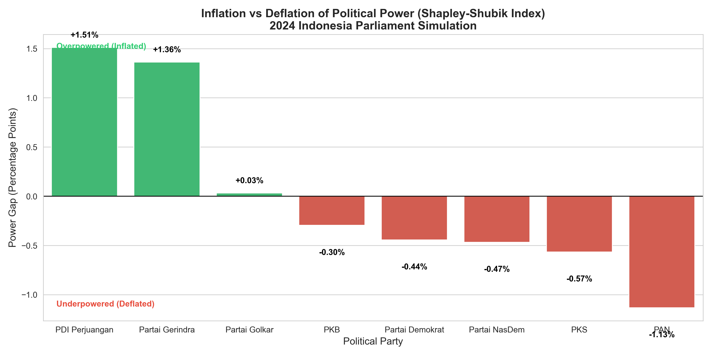

# Analisis Kekuatan Politik Riil: Pendekatan Teori Permainan Kooperatif 🏛️


---

## 📄 Abstrak

Proyek ini merupakan studi komputasional yang bertujuan untuk mengevaluasi **Indeks Kekuatan Shapley-Shubik** (*Shapley-Shubik Power Index*) pada komposisi Dewan Perwakilan Rakyat Republik Indonesia (DPR RI) pasca-Pemilu 2024. Penelitian ini mendemonstrasikan bahwa dalam sistem multi-partai, proporsi kursi parlemen tidak memiliki korelasi linear sempurna dengan kekuatan tawar (*bargaining power*) politik yang sesungguhnya.

Melalui simulasi *Weighted Voting Game* yang dikembangkan menggunakan **Python**, studi ini berhasil mengidentifikasi fenomena inflasi dan deflasi kekuasaan pada fraksi-fraksi partai politik di Indonesia.

---

## 🔍 Temuan Utama

Berdasarkan analisis data perolehan kursi resmi (KPU), ditemukan disparitas antara jumlah kursi dan kekuatan riil:



### 1. Fenomena Partai Penentu (*The Kingmaker Effect*)
Partai-partai papan tengah (**NasDem**, **PKB**, dan **PKS**) menunjukkan nilai **Inflasi Kekuatan** yang positif. Hal ini mengindikasikan bahwa posisi strategis mereka dalam pembentukan koalisi mayoritas memberikan daya tawar yang melampaui proporsi kursi aktual yang mereka miliki.

### 2. Deflasi Kekuatan Mayoritas
Dua partai terbesar, **PDIP** dan **Partai Golkar**, mengalami **Deflasi Kekuatan**. Meskipun menguasai jumlah kursi terbesar, efisiensi kekuatan mereka tereduksi karena kebutuhan mutlak akan mitra koalisi untuk mencapai ambang batas parlemen (291 kursi).

---

## ⚙️ Metodologi

Sistem ini mengimplementasikan alur kerja data (*data pipeline*) otomatis sebagai berikut:

### 1. Akuisisi Data (*Data Acquisition*)
Modul `01_scrape_data.py` melakukan ekstraksi data perolehan kursi terkini dari laman resmi publikasi pemilu atau sumber terverifikasi menggunakan teknik *web scraping*.

### 2. Pemodelan Matematis (*Mathematical Modeling*)
Diterapkan model fungsi karakteristik koalisi $[q; w_1, w_2, \dots, w_n]$ dengan:
*   **$q$ (Quota)**: 50% + 1 dari total kursi (291).
*   **$w_i$ (Bobot)**: Jumlah kursi partai ke-$i$.

### 3. Komputasi Algoritma
Kekuatan setiap entitas dihitung menggunakan formula Shapley-Shubik:

$$ \phi_i = \sum_{S \subseteq N \setminus \{i\}} \frac{|S|! (n - |S| - 1)!}{n!} [v(S \cup \{i\}) - v(S)] $$

Algoritma ini menghitung kontribusi marginal setiap pemain dalam $n!$ (faktorial) permutasi koalisi yang mungkin terjadi.

---

## 💻 Struktur Repositori

| Berkas/Direktori | Deskripsi |
| :--- | :--- |
| `shapley.py` | Implementasi inti (*Core Logic*) dari algoritma *Weighted Voting Game*. |
| `run_pipeline.py` | Skrip orkestrasi untuk menjalankan seluruh tahapan analisis secara sekuensial. |
| `validation_pipeline/` | Direktori yang memuat skrip modular (scraping, cleaning, modeling, visualization) serta artefak data hasil analisis. |
| `ShapleyShubik_Template.xlsx` | Perangkat lunak bantu berbasis Excel untuk simulasi skala kecil (edukatif). |

---

## 🚀 Panduan Penggunaan

Untuk mereplikasi hasil penelitian ini pada lingkungan lokal Anda:

1.  **Kloning Repositori**
    ```bash
    git clone https://github.com/username/analisis-kekuatan-politik.git
    cd analisis-kekuatan-politik
    ```

2.  **Instalasi Dependensi**
    Pastikan Python 3.8+ telah terinstal, kemudian jalankan:
    ```bash
    pip install -r requirements.txt
    ```

3.  **Eksekusi Analisis**
    Jalankan perintah berikut untuk memulai pipeline dari awal:
    ```bash
    python run_pipeline.py
    ```

---

## 👤 Informasi Penulis

**Proyek Akhir Mata Kuliah Riset Operasi**
*Program Studi Matematika Murni*

Studi ini didedikasikan untuk memberikan wawasan objektif berbasis data mengenai dinamika politik parlemen di Indonesia.

---
*"Power is not proportional to size. The essence of power lies in being pivotal."* 
— Shapley & Shubik (1954)
